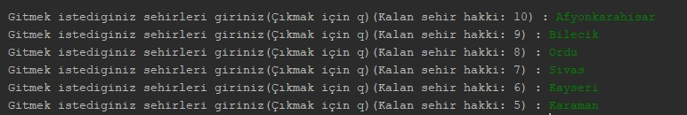

=== Gezgin Kargo Problemi

Gezgin kargo problemine çözüm üretmek için geliştirilmiş bir uygulamadır. Çıkış şehri Kocaeli olan bir kargo aracın için en kısa dağıtım ve dönüş güzergahı oluşturulur. Gidilecek şehirlerin sıralaması ve mesafeler konsol üzerinde gösterilir. Harita üzerinde ise gidilecek oluşturulan rotaların görselleştirilmesi yapılır.

Uygulama sehirler.txt ve komsular.txt dosyalarını kullanarak şehir ve komşuluk ilişkilerini graf veri yapısı üzerinde tutmaktadır.

Geliştirme aşamasında IDE olarak NetBeans, programlama dili olarak Java, görselleştirme için ise https://graphstream-project.org/[GraphStream] dinamik grafik kütüphanesi kullanılmıştır.

==== Uygulamanın Çalışma Aşamaları

*Kullanıcı Girdileri*

Maksimum 10 şehir olmak üzere kullanıcı gideceği şehirleri yazar ve girdi işlemini sonlandırmak için "q" ya basar.

*Rota Planlaması*

Çıktı ekranı üzerinde girilen şehirler oluşturulan en kısa güzergah baz alınarak sıralı halde yazdırılır.

*Rota Görselleştirilmesi*

Oluşturulan rota dahilindeki yol ve şehirler boyanarak harita üzerinde gösterilir.

image::img/3.jpg[width=1000px]